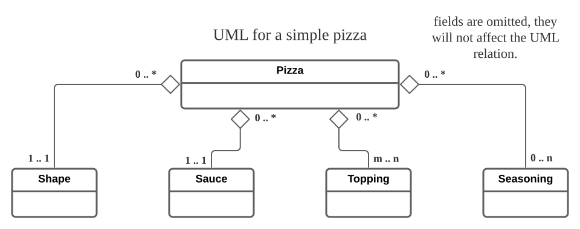

## About
This is a simple single page application for ordering pizza online. This is not meant for production.

## Blueplan

Frontend
pnpm
vite
svelte

Package manager
frontend framework
Bundler, build tool

Database
Server, Backend

Backend
postgreSQL
python
django
graphene-django
(do note that "graphene" alone is a closely-related package. You need graphene-django to make a scheme and set up
an API.)

## UML
A very simple UML model for pizza is provided. Essentially, for one pizza, you choose one shape, one sauce, some topping and some seasoning.

Note that, conversely, each ingredient will (likely) appear in multiple pizza. This is not as obvious as it seems. Most often we think the pizza we ordered has an indepedent existence with any other pizza. The issue here is confusion of instance vs class. Although each pizza is separate and indepedent, they are always made of a small set of ingredients.

## Admin page
I have set up a read-only user so that you can login the admin page and have a look inside.

| username    | password       |
|-------------|----------------|
| view_client | enter_pizzeria |

This account cannot modify anything, not even making an order.

## Technical commentary

    <ul>
        <li>
            A database is meaningless for a singleton. But under Django framework, it is the easiest way to implment a site-wide setting that allows modifications.
        </li>
        <li>
            Svelte. I had a quick glance at the features Svelte provide. I am quite familiar with React and I feel like Svelte has integrated some of my favourite React frameworks, such as MobX, Framer Motion into native features. State management is notorious in React. Hopefully this is handled better in Svelte.
        </li>
        <li>
            Graphene-django framework for GraphQL API. There is now layer upon layer of abstraction. The django model is an abstraction over database. The graphene schema is an abstraction over django model. But at least these two are necessary. The first allows construction of database without dependence on the specific database (MySQL, PostgreSQL, SQLite etc.). The second allows us to selectively expose some field that will participate in API processes.
        </li>
        <li>
            (placeholder)
        </li>
    </ul>

